# Diabetic Retinopathy Stage Detection with Transfer Learning

**Computer Vision coursework, BSc (Hons) Computer Science, NIBM**
**Author:** L.M. Navaratna
**Dataset:** APTOS 2019 Blindness Detection (Kaggle)

This project looks at a colour photo of the back of the eye (a fundus photo) and grades how far diabetic retinopathy (DR) has progressed, on the standard five-step scale:

| Grade | Stage | What it means in plain words |
|---|---|---|
| 0 | No DR | No signs of damage |
| 1 | Mild | Tiny bulges in the small blood vessels (microaneurysms) |
| 2 | Moderate | More damage, some bleeding and leaking. A specialist should see the patient |
| 3 | Severe | Large areas of the retina are starved of blood. Urgent referral |
| 4 | Proliferative DR | New, fragile blood vessels grow and can bleed. Highest risk of sight loss |

Three pretrained CNNs (EfficientNet-B3, EfficientNet-B0 and ResNet50) are fine-tuned with one identical recipe and then combined into a soft-vote ensemble. Every important choice in that recipe (preprocessing, augmentation, class balancing, freezing, learning rate and regularisation) was **tested by experiment rather than assumed**. The finished models power **DRxVision**, a Streamlit web app that grades an uploaded photo, shows a Grad-CAM heat map of where the model looked, flags results that need a human to double check, and prints a one-page screening report.

## Headline results

All numbers below come from 550 test photos that were locked away until every decision had been made, and were used only once.

| Model | Test QWK (95% CI) | Accuracy | Macro F1 |
|---|---|---|---|
| EfficientNet-B3 | 0.872 (0.839 to 0.898) | 80.6% | 0.623 |
| EfficientNet-B0 | 0.877 (0.842 to 0.909) | 82.2% | 0.650 |
| ResNet50 | 0.874 (0.838 to 0.902) | 80.7% | 0.631 |
| **Ensemble (soft vote)** | **0.900 (0.873 to 0.925)** | **84.2%** | **0.684** |

| Screening question | Sensitivity | Specificity | ROC AUC |
|---|---|---|---|
| Does this patient need a specialist? (grade 2 or above) | 92.8% | 94.2% | 0.985 |
| Is there any DR at all? (grade 1 or above) | 97.8% | 97.8% | 0.999 |

In simple terms: the ensemble gives exactly the right grade 84% of the time, and when it is wrong it is usually only one grade out. Out of 223 test patients who needed a referral, it would have referred 207 of them.

**What is QWK?** Quadratic Weighted Kappa measures how well the model agrees with the expert graders, where 1.0 is perfect agreement and 0 is no better than chance. Unlike plain accuracy, it punishes big mistakes much more than small ones: calling a Moderate eye Mild costs 0.06 of the worst-case penalty, but calling a Proliferative eye No DR costs the full 1.0. That fits a graded disease, which is why it is the main metric throughout.

## Quick links

| What | Where |
|---|---|
| Full pipeline notebook | [`notebooks/ComputerVisionCW_LM_Navaratna_002_16114793_1.ipynb`](notebooks/ComputerVisionCW_LM_Navaratna_002_16114793_1.ipynb) |
| Web app | [`app.py`](app.py), run with `streamlit run app.py` |
| Live app | https://dr-grade-assessment.streamlit.app/ |
| Video demo | https://youtu.be/Uij00GUm46o |
| Kaggle Notebook | https://www.kaggle.com/code/livirunavaratna004/cv-cw-lm-navaratna-002-16114793-experiments/ |
| Every figure and table | [`outputs/`](outputs/) |
| Trained model weights | [`models/`](models/) |

## Repository map

```
Diabetic-Retionopathy-Grade-Detection_CW/
├── README.md                  you are here
├── app.py                     DRxVision Streamlit app (the user interface)
├── dr_inference.py            everything needed to grade one photo: preprocessing, models,
│                              ensemble, Grad-CAM and photo quality checks
├── dr_report_pdf.py           builds the one-page A4 screening report as a PDF in memory
├── app_config.json            settings exported by the notebook, so the app copies its
│                              preprocessing exactly
├── requirements.txt           packages for the app (CPU-only PyTorch)
├── LICENSE                    GNU GPL v3
├── .streamlit/config.toml     app theme and upload size limit
├── .devcontainer/             lets the app open and run straight away in GitHub Codespaces
├── assets/                    app icons and the sample photo strip used by the app
├── models/                    the three trained models in half precision, loaded by the app
├── notebooks/                 the single end-to-end Kaggle notebook
├── outputs/
│   ├── figures/               every chart and image the notebook saved, one folder per section
│   ├── results/               every table and JSON file the notebook saved, same folder names
│   └── models/                empty on purpose, see outputs/README.md
├── data/                      empty on purpose, the dataset lives on Kaggle
└── report/                    the PDF report and the figures picked for it
```

Each folder has its own README that explains its contents in more detail.

## How the pipeline works

```mermaid
flowchart LR
    A[APTOS 2019<br/>3,662 photos] --> B[Smoke tests<br/>and exploration]
    B --> C[Preprocessing<br/>crop, pad, mask,<br/>CLAHE, 384 x 384]
    C --> D[Stratified split<br/>70 / 15 / 15]
    D --> E[Augmentation<br/>flips + rotation<br/>training only]
    E --> F[Six controlled<br/>experiments on B0]
    F --> G[Final training<br/>B3, B0, ResNet50]
    G --> H[Soft-vote<br/>ensemble]
    H --> I[One-time test<br/>evaluation]
    I --> J[Grad-CAM and<br/>error analysis]
    J --> K[Export to<br/>DRxVision app]
```



### 1. Checking and exploring the data
Smoke tests run before anything else: every label has a photo and every photo has a label, every grade is a whole number from 0 to 4, and the rarest grade has enough photos to split safely. All three passed.

The exploration showed two problems the rest of the pipeline has to deal with:

* **The grades are very unbalanced.** Almost half the photos (49.3%) are No DR, while Severe is only 5.3%. The biggest grade has 9.4 times more photos than the smallest.
* **Photo sizes vary a lot.** There are 17 different resolutions, from 474 x 358 up to 4288 x 2848 pixels, and many photos cut off the top and bottom of the eye.

### 2. Preprocessing
Every photo goes through the same steps: crop the black border, pad the crop to a square (so the eye is not squashed into an oval), blank out everything outside the circle of the eye, apply a contrast step, and resize to 384 x 384.

Three contrast steps were built and compared: none at all (resize only), **CLAHE** on the brightness channel, and the **Ben Graham** method (subtracting a blurred copy). CLAHE roughly doubled local contrast inside the eye and Ben Graham tripled it, but higher contrast does not automatically mean better grading, so the winner was decided by experiment (see below). CLAHE won. It also keeps natural colours, which makes the Grad-CAM heat maps easier for a clinician to read.

The image size of 384 was checked with an SSIM study on 100 photos: 384 keeps 97.7% of the fine structure of a 1000 x 1000 version, while going up to 512 would only add about 0.7 points of SSIM and make training roughly 1.8 times slower. At 512 the three models no longer all fit in the T4's memory with a batch of 16.

### 3. Splitting and balancing
The photos are split 70% training (2,563), 15% validation (549) and 15% test (550), with the same mix of grades in every split. Class weights were worked out from the training split only, so no information leaks from validation or test.

### 4. Augmentation
Augmented photos are synthetic: they are made by randomly flipping and rotating real photos. They are used **only during training**, never for validation or test, so every reported score comes from real, unchanged photos. This is acceptable because a fundus photo has no fixed orientation and patients tilt their heads, so a flipped or rotated eye is still a realistic eye.

### 5. The six controlled experiments
Each experiment changes **one** part of the recipe, keeps everything else the same, and trains EfficientNet-B0 twice with two different seeds (42 and 7). The winner is the option with the best average validation QWK, but if a simpler or safer option is within 0.005 QWK of the leader, the simpler one wins, because a change that does not clearly help is not worth the extra complexity. The rule was fixed before any results came in. In total 26 training runs were made.

| Experiment | Options tested | Winner | Why it won |
|---|---|---|---|
| 1. Preprocessing | resize only, CLAHE, Ben Graham | **CLAHE** (0.874) | Highest average QWK, smallest overfitting gap, best Severe recall |
| 2. Augmentation | none, flips and rotation, full, full with zoom out | **Flips and rotation** (0.872) | "Full" led by only 0.002, so the lighter policy won the tie |
| 3. Class balance | plain loss, class-weighted loss | **Plain loss** (0.880) | Higher QWK, although class weights gave better Severe recall (see limitations) |
| 4. Freezing | head only, partial unfreeze, two-phase full unfreeze, full fine-tune | **Two-phase full unfreeze** (0.880) | Full fine-tune led by 0.003, so the safer option won the tie |
| 5. Learning rate | 3e-5, 1e-4, 3e-4 | **1e-4** (0.880) | 3e-4 led by 0.003, so the default won the tie |
| 6. Regularisation | none, label smoothing + weight decay + dropout 0.4 + cosine schedule | **Regularised** (0.883) | Higher QWK **and** the overfitting gap shrank from 0.059 to 0.041 |

Two findings stand out. First, freezing the whole backbone and training only the last layer was clearly worse (0.798), which shows the ImageNet features have to adapt to eye photos to grade them well. Second, no augmentation at all gave the biggest overfitting gap of any option (0.073), which is the evidence that augmentation is needed.

### 6. Final training
All three architectures were trained with the winning recipe: 5 epochs training only the new last layer at a learning rate of 1e-3, then up to 25 epochs fine-tuning everything at 1e-4 with a cosine schedule, AdamW with weight decay 0.01, label smoothing 0.1 and dropout 0.4. Early stopping waits 6 epochs without a gain in validation QWK, and the best epoch by validation QWK is the one kept.

| Model | Parameters | Kept epoch | Validation QWK | Training time |
|---|---|---|---|---|
| EfficientNet-B3 | 10.7 M | 12 of 18 | 0.891 | about 19 min |
| EfficientNet-B0 | 4.0 M | 16 of 22 | 0.887 | about 12 min |
| ResNet50 | 23.5 M | 13 of 19 | 0.897 | about 23 min |

ResNet50 was the best single model on validation, so it is the one used for Grad-CAM. It is also built differently from the two EfficientNets (shortcut connections instead of depthwise blocks), so it tends to make different mistakes, which is exactly what makes combining the three worthwhile.

## Results, explained simply

### The ensemble really is better, not just lucky
The ensemble's confidence interval for QWK overlaps with the single models' intervals, so the intervals alone cannot prove it is better. McNemar's test settles it: on the same 550 photos, the ensemble was right where ResNet50 was wrong 28 times, and the other way round only 9 times (p = 0.003). That is why the app uses the ensemble. The cost is speed: about 0.37 seconds per photo on a CPU, against about 0.18 seconds for ResNet50 alone, which is still fast enough for a clinic.

### How well each grade is recognised (ensemble)

| Grade | Precision | Recall | F1 | Test photos |
|---|---|---|---|---|
| No DR | 0.978 | 0.978 | 0.978 | 271 |
| Mild | 0.642 | 0.607 | 0.624 | 56 |
| Moderate | 0.772 | 0.860 | 0.814 | 150 |
| Severe | 0.643 | 0.310 | 0.419 | 29 |
| Proliferative DR | 0.578 | 0.591 | 0.584 | 44 |

No DR is almost perfect. Severe is the weak spot: only 9 of the 29 Severe photos got exactly the right grade. The good news is where the other 20 went: 12 were called Proliferative and 8 were called Moderate, so **every Severe patient would still have been referred**. None was called No DR or Mild.

### What kind of mistakes it makes
* 71% of the ensemble's mistakes are only one grade off. Just 4.5% of all test photos were two or more grades off.
* The most common mix-up is Mild called Moderate (16 photos), then Proliferative called Moderate (13).
* The 16 missed referrals were mostly Moderate photos called Mild (12). The two most worrying misses were two Proliferative photos called Mild.

### It knows when it is unsure
When the ensemble is 90% sure or more (44.5% of photos), it is right 99.2% of the time. When it is less than 50% sure, it is right less than half the time. The app uses this: any result under 60% confidence is flagged for a human to review. That flag covers 19.3% of photos but catches 49.4% of all mistakes. Adding a second flag for when the three models disagree catches 52.9%. Accuracy on the photos that are **not** flagged is 90.1%.

### Overfitting is present but controlled
At the kept epoch the gap between training and validation QWK is about 0.05 to 0.07. Part of that gap is expected, because training QWK is measured on augmented photos, which are harder than clean ones. Validation QWK dropped by only 0.01 to 0.02 when moving to the test set, which suggests the many validation-based decisions did not flatter the results much.

### Where the model looks (Grad-CAM)
For the first test photo of each grade, the ResNet50 heat maps tend to land on bright yellow patches and dark red blotches inside the retina, which look like exudates and haemorrhages, rather than on the black background. The photos were picked automatically, not hand-chosen, and ResNet50 on its own graded only two of those five correctly, so the figure is an honest sample rather than a showcase. Grad-CAM on the four biggest mistakes is just as useful: one is a very pale, washed-out photo, and in another the heat sits on the edge of the field of view, which points to photo quality as one cause of the worst errors.

## What this project adds beyond the brief

* **Every choice is evidenced.** Six controlled experiments, each run with two seeds and a tie rule fixed in advance, plus an image size study that needs no training at all.
* **Automatic smoke tests** at every stage: data, preprocessing, augmentation and models are checked with pass or fail tests before the next stage is built on them.
* **A statistically checked ensemble.** Bootstrap confidence intervals and McNemar's test show the ensemble's gain is real.
* **A screening view** that turns five grades into the two yes or no questions a clinic actually asks.
* **Confidence and disagreement flags** that send uncertain cases to a human.
* **Grad-CAM explanations**, including on the model's worst mistakes.
* **DRxVision**, a working web app with photo quality warnings, a per-model breakdown, a referral meter, a downloadable one-page PDF report, and no data written to disk.
* **An app parity check.** The app's half-precision models were rebuilt from the exported files and gave the same grade as the notebook on 50 out of 50 test photos (largest probability difference 0.006).

## The DRxVision app

The app has six tabs that follow the same order as the pipeline, so it doubles as a walkthrough for the video demo.

| Tab | What it shows |
|---|---|
| Screening | Patient details, photo upload, the ensemble grade with confidence, a referral meter, review flags, photo quality warnings, the Grad-CAM heat map, each model's own grade, the last five cases of the session, and the PDF report download |
| Dataset exploration | Grade counts, sample photos and photo size statistics from the notebook |
| Image Preparation | Every preprocessing step applied to the uploaded photo, plus the preprocessing experiment results |
| Augmentation & Balancing | Random training versions of the uploaded photo, plus the augmentation and class balance results |
| How the model works | Interactive diagrams of each CNN architecture, the two-phase training timeline, training curves and the six experiment decisions |
| Evaluation | Confusion matrix, per-grade scores, screening metrics and confidence analysis on the 550 test photos |

Grades 0 and 1 are marked as routine follow-up, grade 2 as referral advised, and grades 3 and 4 as urgent referral. A result is flagged for review when confidence is under 60%, when the three models disagree, or when the referral probability is borderline (between 35% and 65%).

## Honest limitations

* **One dataset only.** APTOS 2019 comes from clinics in India. The models have not been tested on other cameras or populations, so performance elsewhere may be lower.
* **Severe is under-recognised.** Severe recall is only 0.31. Class weights raised Severe recall on validation (0.60 against 0.38) but cost some QWK, and the rule chose QWK. A clinic might reasonably make the opposite trade.
* **Experiments used EfficientNet-B0 only** to fit the GPU budget. The recipe is assumed to carry over to B3 and ResNet50.
* **A small shape distortion remains.** The preprocessing test required every photo to keep its eye shape within 3%. 80% of the 50 test photos passed. The photos where the eye was cut at the top and bottom still averaged about 3.2% distortion.
* **Label noise.** Neighbouring grades (Mild and Moderate especially) are hard to tell apart even for experts, and each APTOS photo carries a single label.
* **CLAHE settings were not tuned.** Clip limit 2.0 on an 8 x 8 grid is a common default and is listed as future work.
* **Not a medical device.** The app is a screening aid prototype and has not been clinically validated. Every result must be checked by a qualified professional.

## How to reproduce

### Retrain everything on Kaggle
1. Open the notebook on **Kaggle Notebooks**.
2. Click **Add Input**, search for `aptos2019-blindness-detection` and attach it. The notebook reads it from `/kaggle/input/competitions/aptos2019-blindness-detection`.
3. In the session options, turn on the **GPU T4** and turn **Internet on** (the pretrained ImageNet weights are downloaded from PyTorch).
4. Use **Save Version** and **Save & Run All (Commit)** so the whole notebook runs once, top to bottom, in one clean session.
5. Expect roughly **4 to 5 hours** in total. The six experiments take about 3.5 hours of that, the final three models about 55 minutes, and building the preprocessing caches about 15 minutes.
6. Download `figures/` and `results/` from the output tab into `outputs/`. Copy `app_export/app_config.json` to the repo root and `app_export/models/*.pth` into `models/`.

The seed is fixed to 42 (plus 7 for the repeat experiment runs) and the GPU is told to use repeatable maths where it can. The figures and tables in `outputs/` came from the committed Kaggle run, while the outputs printed inside the notebook came from a separate run of the same code. Every score, split and decision is identical between the two. Only timings (minutes and milliseconds) differ slightly, which is normal on shared GPUs, and is good evidence that the pipeline is repeatable.

### Run the app on your own computer
Training is not needed to run the app. It only does a forward pass, which is fast on a CPU.

```bash
python3 -m venv dr_env
source dr_env/bin/activate          # on Windows: dr_env\Scripts\activate
pip install -r requirements.txt
streamlit run app.py
```

Then open `http://localhost:8501` and upload a fundus photo (PNG or JPEG).

### Run the app in GitHub Codespaces
Open the repo in a Codespace. The dev container installs the requirements and starts the app on port 8501 automatically.

## Tools and technologies

| Area | Used |
|---|---|
| Language | Python 3.12 on Kaggle, 3.11 in the dev container |
| Deep learning | PyTorch 2.10 and torchvision 0.25, with pretrained ImageNet weights |
| Image processing | OpenCV 4.13 (cropping, masking, CLAHE, Ben Graham), Pillow |
| Evaluation | scikit-learn (metrics, splits, class weights), SciPy (McNemar's test), a hand-written SSIM function for the image size study |
| Charts | Matplotlib and Seaborn in the notebook, Altair in the app |
| App | Streamlit, ReportLab for the PDF report |
| Compute | Kaggle Notebooks with an NVIDIA Tesla T4 (16 GB) |

## Dataset and ethics

The dataset is the [APTOS 2019 Blindness Detection](https://www.kaggle.com/c/aptos2019-blindness-detection) competition data from Kaggle: 3,662 labelled fundus photos collected by Aravind Eye Hospital in India. The photos are not stored in this repository because they belong to the competition and are shared under Kaggle's competition rules. They are attached to the notebook as a Kaggle input instead. A few photos appear as small examples inside figures purely to illustrate the method. The app keeps uploaded photos and patient details in memory for the browser tab only, and nothing is saved, logged or sent anywhere else.